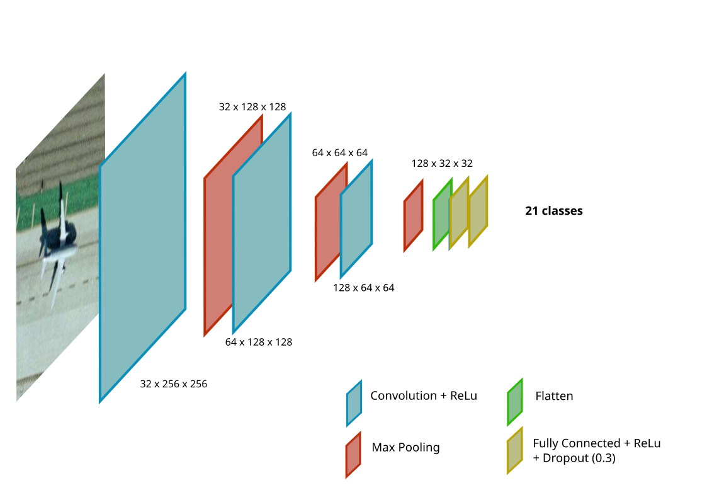

# Deep Learning for Remote Sensing Classification

 This work is licensed under a <a rel="license" href="http://creativecommons.org/licenses/by-nc-nd/4.0/">Creative Commons Attribution-NonCommercial-NoDerivatives 4.0 International License</a>.

---

## **Project Overview**

This is a research project aimed at automating land-use characterization from aerial imagery using deep learning techniques. The project explores convolutional neural networks (CNNs) and transfer learning with ResNet, applied to both single-label and multi-label classification tasks using the UCM Dataset. The primary objective is to develop, evaluate, and compare classification models to assess their effectiveness in remote sensing applications.

The repository contains:

- A research notebook [RSCProject.ipynb](RSCProject.ipynb) detailing the model implementation and results.

- [Subject.pdf](Subject.pdf) outlining the project requirements.

- [Report.pdf](Report.pdf) presenting the research methodology and findings.

**Please read the above files for a comprehensive understanding of the project.**

---

[Installation and Execution](#installation) •
[Classification Models](#classification-models) •
[Contributions](#contributions)

## Features

 - Single-label classification using CNN and ResNet.

 - Multi-label classification with dataset relabeling.

 - Performance evaluation with confusion matrices and various metrics.

 - Implementation of data augmentation techniques.

 - Exploration of transfer learning to enhance classification accuracy.

## Table of Contents

- [Installation](#installation)
  - [Pre-requisites](#pre-requisites)
- [Classification Models](#classification-models)
  - [Single-label CNN](#single-label-cnn)
  - [ResNet Transfer Learning](#resnet-transfer-learning)
  - [Multi-label Classification](#multi-label-classification)
- [Contributions](#contributions)
  - [Authors](#authors)

# Installation
[(Back to top)](#table-of-contents)

## Pre-requisites

Make sure you have Python installed and a tool to read Jupyter Notebooks.

Dependency installations are included in the notebook.

# Classification Models
[(Back to top)](#table-of-contents)

## Single-label CNN

Characterizing land-use from aerial imagery is a key challenge in remote sensing. CNNs are widely used for this task due to their efficiency in feature extraction. The dataset used consists of 21 land-use classes, each containing 100 high-resolution images (256x256 pixels).

Our initial approach was to implement a baseline CNN model to establish a reference point before exploring more advanced techniques.

**CNN Model Architecture:**

 - Convolutional layers with increasing depth

 - Batch normalization and dropout regularization

 - Image augmentation techniques to enhance generalization

*The architecture of one of the tested models*

## ResNet Transfer Learning

To further improve performance, we leveraged transfer learning using ResNet, a pre-trained deep learning model recognized for its strong feature extraction capabilities. ResNet allows us to:

 - Utilize pre-trained knowledge on large datasets.

 - Fine-tune only the final layers to adapt to aerial image classification.

## Multi-label Classification

Unlike single-label classification, multi-label classification allows each image to belong to multiple categories simultaneously. This dataset contains 17 redefined classes where an image can include multiple objects such as "airplane," "tree," "sea", etc.

To handle this challenge, we:

 - Implemented a sigmoid-based classification instead of softmax.

 - Used threshold tuning to determine label presence.

Applied custom loss functions to balance class representation.

# Contributions
[(Back to top)](#table-of-contents)

## Authors

- [**Alexandre Deloire**](https://github.com/alexdeloire)
- [**Remi Jorge**](https://github.com/RemiJorge)
- [**Jiayi He**](https://github.com/JiayiHE95)
